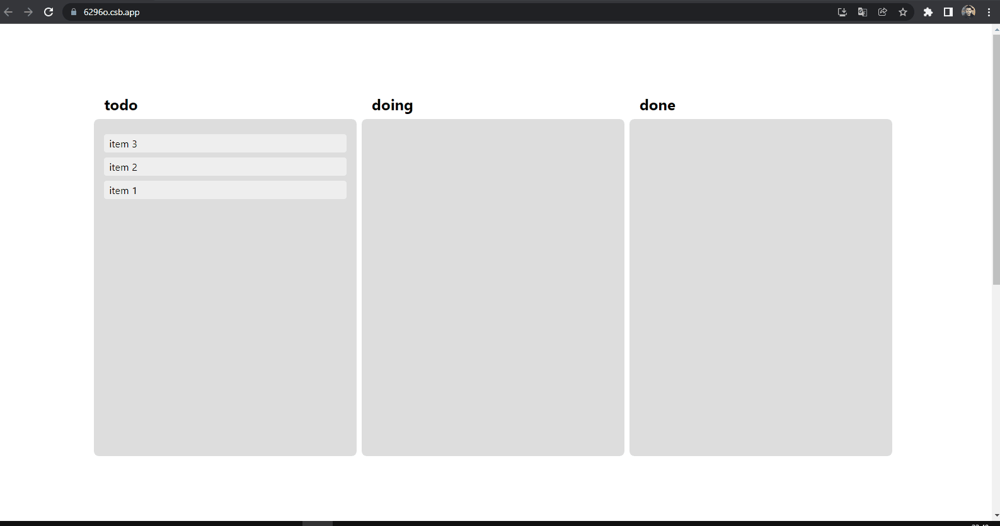

<h1 align="center">
  
   
  Drag Drop using context, react beautifull and type script. 
</h1>

<h3 align="justify">
Didactic application with a drag and drop system using context concepts and with beautifull and typed react. Credits Josh Ellis from the portal dev.to.
</h3>
 

## 📷 Demonstration

<h4 align="left"></h4>
  

 

## 🚀 Technologies

This project was developed with the following technologies:

- [TypeScript](https://www.typescriptlang.org/docs/)
- [ReactJS](https://reactjs.org/)

 

## ⚙ Commands Running
- yarn
- yarn start

## ⚙ Documentation
- <a href=".github/Documentation.pdf">PDF</a>
- [dev.to](https://dev.to/imjoshellis/codealong-multi-column-drag-and-drop-in-react-3781)

Made with 💜 by Rafael Maciel
